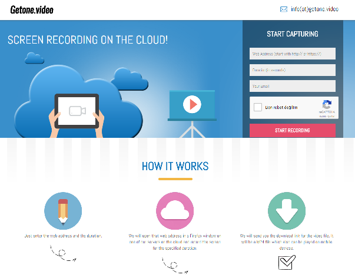

Hakkımda
===
- Advancity (a.k.a. CAZ Bilişim) kurucu ortak
- Yazılımcı
- @xaferel :sunglasses:

---

AWS CodeCommit Hakkında
===

# Features

- Ölçeklenebilir ve sağlam kod kontrol sistemi
- Sınırsız Git deposu oluşturabilme
- Mevcut Git araçları ile uyumlu
- 5 **aktif** kullanıcıya kadar ücretsiz
- Daha fazla bilgi https://aws.amazon.com/codecommit/

---
Getone.video
===
- Ölçeklenebilir tarayıcı kayıt otomasyon servisi :computer: :movie_camera:
- Perculus oturumlarının tek videoya çevrilmesi için geliştirildi
- AWS EC2 üzerinde çalışır 
- Şu anda herkese açık bir bulut servisi :cloud::cloud::cloud:

---

Sorun
===

- Tek kişilik bir yazılım projesi :boy::computer:
- Geliştirme-test-dağıtım 
- WinSCP ile bağlanma ve kodları güncelleme
- Sunucu sayısı artınca (10+) çok zaman kaybı
- Sürekli kod güncelleme gerekliliği

---

İhtiyaç Analizi
===
- Çok az zaman kaybı
- Çok kolay olmalı
- Ekstra kişiye ihtiyaç olmamalı :smiley:

---

Çözüm 1 - AWS AMI Çoklama
===

- WinSCP ile tek sunucu güncelle
- AWS AMI oluştur
- AMI ile sunucu oluştur
- Eski sunucuları kaldır
- :unamused: Manuel işlem çok, hataya açık, zaman kaybı

---
Çözüm 2 - AWS CodeCommit :+1:
===
- AWS CodeCommit üzerinde uzak Git deposu oluştur
- CodeCommit deposunu, bilgisayarında Git uzak deposu olarak ekle
- AWS EC2 üzerinde depoyu çiftle (git clone)
- Git postcommit kancasını ayarla
- Sistem başlangıcında depoyu güncelle (git pull)

---

Neden AWS CodeCommit
===
- Sadece kodları CodeCommit deposuna göndermek yeterli
- Her sunucu açıldığında kendini günceller
- AWS EC2 kullanıldığı için CodeCommit tercih edildi
- Başka bir Git sistemi de (Github, Bitbucket vs. olabilir)
